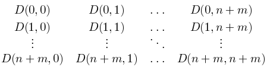

<a class="link" href="/yacup/contest/42200/enter/?retPage=">Yandex Cup 2022: Алгоритм, марафон (квалификация)</a>

   

      <h1 class="title">A. Перемещение самокатов</h1>
      <table>
         <tbody><tr class="input-file">
            <td class="property-title">Ввод</td>
            <td colspan="1">inputX.txt</td>
         </tr>
         <tr class="output-file">
            <td class="property-title">Вывод</td>
            <td colspan="1">outputX.txt</td>
         </tr>
      </tbody></table>
   

   <h2></h2>
   

         
В одном городе есть n самокатов, которые расположены в местах с низким пользовательским спросом. В этом же городе есть m парковочных мест, которые находятся в зонах с высоким пользовательским спросом. Мы хотим переместить как можно больше самокатов
            с исходных точек на парковочные места (не более одного самоката на одно парковочное место).
         

Перемещать самокаты мы будем с помощью k автомобилей (фургонов). Все они изначально находятся в некоторой заданной точке. Для каждого автомобиля можно выбрать маршрут,
         который будет посещать в некотором порядке самокаты и парковочные места. Для выбранных маршрутов есть следующие ограничения:
         
<ul>
            <li>Каждый автомобиль имеет некоторое ограничение на максимально допустимую длину маршрута. </li>
            <li>Вместимость каждого автомобиля — 25 самокатов. Это значит, что в любой момент времени в автомобиле может находиться не более 25 самокатов. При этом за весь маршрут можно переместить больше 25 самокатов. 
            </li>
         </ul>
      

      
При этих ограничениях мы хотим переместить как можно больше самокатов с исходных точек на парковочные места (не более одного
         самоката на одно парковочное место).
      

      
Для простоты можно считать, что в городе есть n + m + 1 точек: 
         
<ul>
            <li>начальная точка с k автомобилями (точка с индексом 0); 
            </li>
            <li>n самокатов (точки с индексами 1, …, n); 
            </li>
            <li>m парковочных мест (точки с индексами n + 1, …, n + m). 
            </li>
         </ul>
      

      
Расстояние между точками задано квадратной матрицей D, где элемент D(i, j) задает расстояние от точки i до точки j (0 ≤ i, j ≤ n + m).
      

      
Для заданной матрицы расстояний справедливо «неравенство треугольника»: для любых трех точек v1, v2, v3 выполняется неравенство D(v1, v3) ≤ D(v1, v2) + D(v2, v3). Таким образом, автомобилям не имеет смысла посещать некоторую точку в качестве промежуточной (не для того, чтобы забрать
         или оставить там самокат).
      

      
Решением будет являться набор из k маршрутов (возможно пустых), которые не пересекаются по посещенным точкам и удовлетворяют заданным ограничениям на длину маршрута и вместимость автомобиля.
      

   

   <h2>Формат ввода</h2>
   

         
Входные данные находятся в файлах input1.txt, input2.txt, …, input30.txt. Вам нужно скачать архив со страницы задачи и распаковать его.
         

Первая строчка входного файла содержит три целых положительных числа n, m и k (1 ≤ n, m ≤ 1000, 2 ≤ k ≤ 5) — количество самокатов, парковок и автомобилей соответственно.
      

      
Следующие n + m + 1 строчек содержат по n + m + 1 чисел — матрицу расстояний D (0 ≤ D(i, j) ≤ 105, 0 ≤ i, j ≤ n + m). В i-й (0 ≤ i ≤ n + m) строчке заданы элементы D(i, 0), D(i, 1), …, D(i, n + m).
      

      
Другими словами, матрица задана в следующем виде: 
         

 Гарантируется, что на главной диагонали матрицы расположены нули. При этом матрица может и не быть симметричной.
      

      
Последняя строчка входного файла содержит k положительных чисел d1, d2, …, dk (0 ≤ di ≤ 105) — ограничения на длину маршрутов автомобилей.
      

   

   <h2>Формат вывода</h2>
   

         
Вам нужно отправить на проверку zip-архив с файлами output1.txt, output2.txt, …, output30.txt, где выходной файл outputX.txt должен соответствовать входному файлу inputX.txt. Если какой-то из файлов будет отсутствовать в архиве, то этот тест будет проигнорирован при тестировании.
         

Выходной файл должен состоять из k строк. В i-й строчке должен быть представлен маршрут i-го автомобиля.
      

      
Первым в i-й строке должно идти число si — количество точек в маршруте i-го автомобиля, не считая стартовую точку (с индексом 0). Далее в этой же строке через пробел должны быть перечислены si индексов посещенных точек.
      

      
Также в отправляемый zip-архив добавьте все исходные коды, которые были написанные вами. Исходные коды не будут запускаться на сервере, но мы проверим их наличие после окончания соревнования.
      

      
Оценка

Определение корректности набора маршрутов:

            

               
<ul>
                  <li>Выведенные маршруты не должны пересекаться по посещенным точкам и не должны содержать точку 0.
                     

                  </li>
                  <li>Длина маршрута i-го автомобиля не должна превышать di. Длиной маршрута считается сумма расстояний между последовательными точками маршрута. Расстояние от стартовой точки 0 до первой точки маршрута тоже учитывается.
                     

                  </li>
                  <li>В любой момент времени в автомобиле может находиться не более 25 самокатов.
                     

                  </li>
                  <li>В конце маршрута в автомобиле не должно оставаться самокатов.

                  </li>
                  <li>При посещении точки с самокатом в автомобиле должно быть строго меньше 25 самокатов, а при посещении парковочного места в автомобиле должен быть хотя бы один самокат. 
                  </li>
               </ul>
            

            
Если выведенный набор маршрутов является корректным, то количество набранных баллов будет равно количеству перемещенных самокатов.
               Иначе вы получите ноль баллов за этот тест.
            

            
Общий результат вашего решения будет равен сумме баллов по всем тестам.

            
500 очков за эту задачу равны одному квалификационному баллу. Таким образом, для прохождения в финал направления «Алгоритм» необходимо набрать не менее 10 000 очков.

   

   <h2>Примечания</h2>
   

         
Пример  

Ввод:  3 4 2  0 1 2 4 3 4 3 1  1 0 1 5 2 3 4 2  2 1 0 6 1 2 5 3  4 5 6 0 7 8 1 3  3 2 1 7 0 1 6 4  4 3 2 8 1 0 7 5  3 4 5 1 6 7 0 2  1 2 3 3 4 5 2 0  5 4  

      
Вывод:  2 3 6  4 1 2 4 5  

      
Это решение оптимально, так как все три самоката были перевезены. Длина маршрута первого автомобиля равна 5, а второго — 4.
      

      
В приведенном примере матрица расстояний является симметричной, но для остальных тестов это не обязательно верно.

   

<a class="link link_theme_download inline-block" href="/yacup/contest/42200/download/A/" target="_blank">Скачать условие задачи</a>
