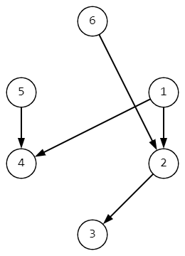

# H. Метасвязность

| Ограничение времени | 4 секунды                                    |
| ------------------------------------- | --------------------------------------------------- |
| Ограничение памяти   | 512Mb                                               |
| Ввод                              | стандартный ввод или input.txt    |
| Вывод                            | стандартный вывод или output.txt |

## 

Полное решение будет оценено в 7 баллов.

Дан направленный ацикличный граф **G**.

Назовем весомостью вершины **v** величину **w**(**v**) — количество отличных от **v** вершин графа **u** таких, что **v** достижима из **u**.

Например, в изображенном графе **w**(**1**)=**0, **w**(**2**)**=2, w(**3**)=3, w(**4**)=2, w(**5**)=0 и w(**6**)=0.

Пусть метасвязность графа **G** определяется формулой **m**c(**G**)**=**max **w**(**v**)**,**v**∈**V**(**G**)**.

Определите, можно ли из графа **G** удалить ровно одно ребро так, чтобы величина метасвязности уменьшилась.

## Формат ввода

Первая строка содержит два целых числа **n** и **m** (**1**≤**n**≤**5**0_**0**0**0**, **0**≤**m**≤**2**0**0**_0**0**0) — количество вершин и дуг в графе.

Каждая из следующих **m** строк содержит два целых числа **a** и **b** (**1**≤**a**,**b**≤**n**, **a**≠**b**), которые задают дугу из вершины **a** в вершину **b**.

Гарантируется, что в графе нет циклов и кратных дуг.

## Формат вывода

Выведите в единственной строке No, если метасвязность уменьшить невозможно.

Иначе в первой строке выведите Yes, а в следующей строке выведите номер ребра, которое надо удалить (ребра нумеруются с 1 в порядке перечисления во вводе).

### Пример 1

| Ввод | Вывод |
| ------------------------------------------------------------------------------------------------------- | ----------------------------------------------------------------------------------------------------------- |
| 6 5                                                                                                     | Yes                                                                                                         |
| 6 2                                                                                                     | 4                                                                                                           |
| 5 4                                                                                                     |                                                                                                             |
| 1 4                                                                                                     |                                                                                                             |
| 1 2                                                                                                     |                                                                                                             |
| 2 3                                                                                                     |                                                                                                             |

### Пример 2

| Ввод | Вывод |
| ------------------------------------------------------------------------------------------------------- | ----------------------------------------------------------------------------------------------------------- |
| 4 3                                                                                                     | Yes                                                                                                         |
| 1 2                                                                                                     | 1                                                                                                           |
| 2 3                                                                                                     |                                                                                                             |
| 2 4                                                                                                     |                                                                                                             |

### Пример 3

| Ввод | Вывод |
| ------------------------------------------------------------------------------------------------------- | ----------------------------------------------------------------------------------------------------------- |
| 4 4                                                                                                     | No                                                                                                          |
| 1 2                                                                                                     |                                                                                                             |
| 2 3                                                                                                     |                                                                                                             |
| 2 4                                                                                                     |                                                                                                             |
| 1 3                                                                                                     |                                                                                                             |
