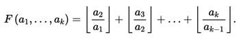

# K. Ступенчатая подпоследовательность

| Ограничение времени | 6 секунд                                      |
| ------------------------------------- | --------------------------------------------------- |
| Ограничение памяти   | 256Mb                                               |
| Ввод                              | стандартный ввод или input.txt    |
| Вывод                            | стандартный вывод или output.txt |

Полное решение будет оценено в 9 баллов.

Для подготовки к семинару Вася с головой погрузился в исследование целочисленных последовательностей. Обнаружив, что возрастающие последовательности глубоко изучены, он направил все силы на изучение ступенчатых последовательностей, в которых возрастающие фрагменты анализируется по отдельности.

Для примера сложности исследования данного вида последовательностей Вася ввел в рассмотрение новую величину ступенчатого роста

Величина ступенчатого роста последовательности длины 1 равна нулю.

Вася собирается перепроверить свой алгоритм поиска подпоследовательности с наибольшим значением величины ступенчатого роста. Предоставьте ему для проверки значения требуемой величины для всех префиксов заданной последовательности.

Дана последовательность **a** длины **n**. Найдите наибольшие значения ступенчатого роста среди подпоследовательностей для всех префиксов **a**, т.е. для последовательностей **[**a**1**], **[**a**1**,**a**2]**, …, **[**a**1**,**a**2**,**…**a**n**].

## Формат ввода

Первая строка содержит число **n** (**1**≤**n**≤**1**0^**6**) — длина последовательности.

Вторая строка содержит **n** целых чисел **a**i (**1**≤**a**i≤**1**0^9).

## Формат вывода

Выведите **n** чисел — наибольшие значения ступенчатого роста среди подпоследовательностей для каждого из префиксов **a**: **[**a**1**], **[**a**1**,**a**2]**, …**[**a**1,**a**2,**…**a**n**].

### Пример 1

| Ввод | Вывод |
| ------------------------------------------------------------------------------------------------------- | ----------------------------------------------------------------------------------------------------------- |
| 5                                                                                                       | 0 2 3 4 5                                                                                                   |
| 1 2 3 4 5                                                                                               |                                                                                                             |

### Пример 2

| Ввод | Вывод |
| ------------------------------------------------------------------------------------------------------- | ----------------------------------------------------------------------------------------------------------- |
| 6                                                                                                       | 0 1 5 5 5 6                                                                                                 |
| 2 2 8 3 2 2                                                                                             |                                                                                                             |

## Примечания

Через **⌊**x**⌋** обозначена целая часть **x** — наибольшее целое число, не превосходящее **x**.
