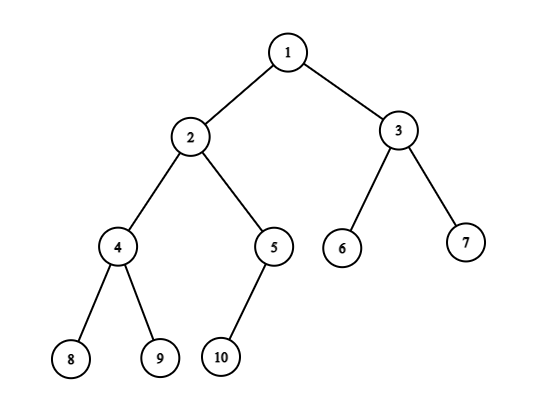
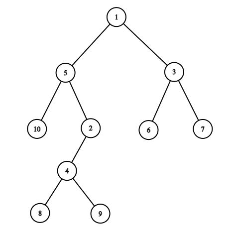
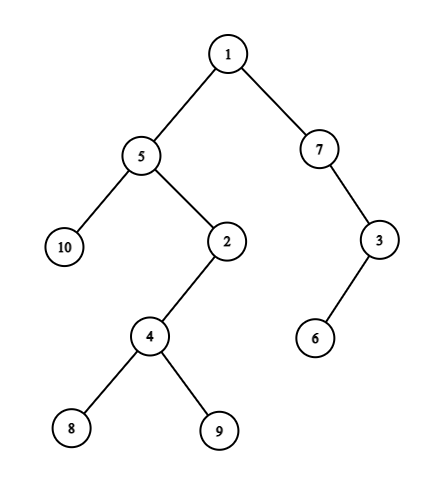
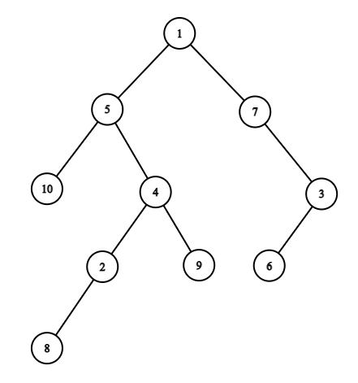
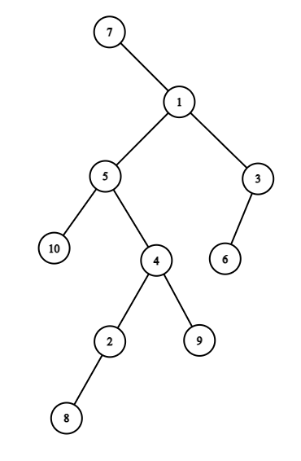
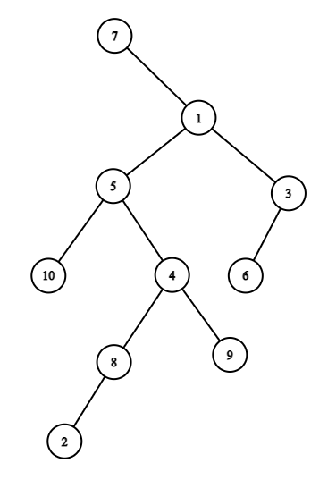

span

   <h2>Формат ввода</h2>
   
 Первая строка содержит два целых числа <!--l. 115-->N
      и <!--l. 115-->Q
      (<!--l. 115-->1≤N≤750;1≤Q≤106)
      — количество вершин в дереве и количество изменений, произошедших с деревом. <!--l. 117-->
      
В следующей строке дано <!--l. 117-->Q
      целых чисел <!--l. 117-->v1,
      <!--l. 117-->v2,
      <!--l. 117-->…, <!--l. 117-->vq
      (<!--l. 117-->1≤vi≤N), где <!--l. 117-->vi
      — номер вершины, обменявшейся местами со своим предком в <!--l. 117-->i-ю
      ночь. 

    Формат ввода

   

   <h2>Формат вывода</h2>
   
 В единственной строке через пробел требуется вывести номера вершин дерева после всех изменений в формате <!--l. 121-->LVR,
      начиная с корня дерева. <!--l. 123-->
      
Формат <!--l. 123-->LVR(v) определяется рекурсивно для вершины <!--l. 123-->v. 
<ol style="list-style-type:
      decimal;">
      <li>если у вершины <!--l. 127-->v
      есть левый ребенок <!--l. 127-->lv,
      то сначала выводится всё поддерево <!--l. 127-->lv
      в формате <!--l. 127-->LVR(lv); </li>
      <li>выводится номер вершины <!--l. 129-->v;
      </li>
      <li>если у вершины <!--l. 131-->v
      есть правый ребенок <!--l. 131-->rv,
      то выводится всё поддерево <!--l. 131-->rv
      в формате <!--l. 131-->LVR(rv); </li>
      </ol>
      

    Формат вывода

   

   <h2>Пример</h2>
   <table class="sample-tests">
      <thead>
         <tr>
            <th>Ввод
<button class="button button_theme_pseudo button_size_s button_only-icon_yes problem__copy-button problem__copy-button_type_input i-bem" data-bem="{"button":{}}" role="button" type="button" title="Скопировать ввод"> </button>
</th>
            <th>Вывод
<button class="button button_theme_pseudo button_size_s button_only-icon_yes problem__copy-button problem__copy-button_type_output i-bem" data-bem="{"button":{}}" role="button" type="button" title="Скопировать вывод"> </button>
</th>
         </tr>
      </thead>
      <tbody>
         <tr>
            <td><pre>10 6
5 7 4 7 8 7
</pre></td>
            <td><pre>7 10 5 2 8 4 9 1 6 3 
</pre></td>
         </tr>
      </tbody>
   </table>
   <h2>Примечания</h2>
   
 Объяснение примера строится из двух частей: <ul>
      <li>Рисунки, показывающие структуру дерева в каждом сне; </li>
      <li>Текстовое пояснение к выводу на тест;</li>
      </ul>
      <!--l. 143-->
      
В тестовом примере дано дерево из <!--l. 143-->10 вершин: 

      <!--l. 145-->
      

      <!--l. 146-->
      

      

      

      <!--l. 149-->
      
Происходит <!--l. 149-->6
      изменений с деревом: 
<ol style="list-style-type: decimal;">
      <li>вершина 5 меняется с вершиной 2: 

      <!--l. 155-->
      

      <!--l. 156-->
      

      

      

      </li>
      <li>вершина 7 меняется с вершиной 3: 

      <!--l. 161-->
      

      <!--l. 162-->
      

      

      

      </li>
      <li>вершина 4 меняется с вершиной 2: 

      <!--l. 167-->
      

      <!--l. 168-->
      

      

      

      </li>
      <li>вершина 7 меняется с вершиной 1: 

      <!--l. 173-->
      

      <!--l. 174-->
      

      

      

      </li>
      <li>вершина 8 меняется с вершиной 2: 

      <!--l. 179-->
      

      <!--l. 180-->
      

      

      

      </li>
      <li>вершина 7 ни с кем не меняется, так как она уже корень: 

      <!--l. 185-->
      

      <!--l. 186-->
      

      

      

      </li>
      </ol>
      <!--l. 191-->
      
После всех изменений выводим получившееся дерево в формате <!--l. 191-->LVR: 
<ul>
      <li>Корень дерева — вершина <!--l. 194-->7;
      </li>
      <li>Выводим вершину 7; </li>
      <li>Выводим поддерево вершины 1 — правого ребенка вершины 7; </li>
      <li>Выводим поддерево вершины 5 — левого ребенка вершины 1; </li>
      <li>Выводим поддерево вершины 10 — левого ребенка вершины 5; </li>
      <li>Выводим вершину 10; </li>
      <li>Выводим вершину 5; </li>
      <li>Выводим поддерево вершины 4 — правого ребенка вершины 5; </li>
      <li>Выводим поддерево вершины 8 — левого ребенка вершины 4; </li>
      <li>Выводим поддерево вершины 2 — левого ребенка вершины 8; </li>
      <li>Выводим вершину 2; </li>
      <li>Выводим вершину 8; </li>
      <li>Выводим вершину 4; </li>
      <li>Выводим поддерево вершины 9 — правого ребенка вершины 4; </li>
      <li>Выводим вершину 9; </li>
      <li>Выводим вершину 1; </li>
      <li>Выводим поддерево вершины 3 — правого ребенка вершины 1; </li>
      <li>Выводим поддерево вершины 6 — левого ребенка вершины 3; </li>
      <li>Выводим вершину 6; </li>
      <li>Выводим вершину 3;</li>
      </ul>
      

      

      

    Пример

   

| Ввод | Вывод |
| -------- | ---------- |
|          |            |

    Примечания

   

