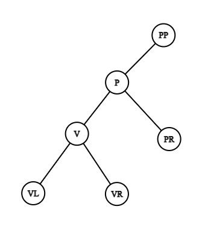
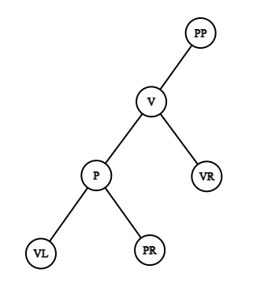
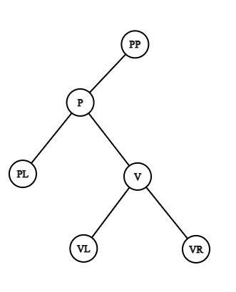
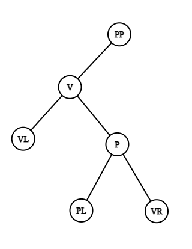

   

      <h1 class="title">C. Приснится же такое...</h1>
      <table>
         <tbody><tr>
            <th>Язык</th>
            <th>Ограничение времени</th>
            <th>Ограничение памяти</th>
            <th>Ввод</th>
            <th>Вывод</th>
         </tr>
         <tr>
            <td width="1%">Все языки</td>
            <td>2&nbsp;секунды</td>
            <td>512Mb</td>
            <td rowspan="7">стандартный ввод или input.txt</td>
            <td rowspan="7">стандартный вывод или output.txt</td>
         </tr>
         <tr>
            <td>
               <nobr>Python 3.7.3</nobr>
            </td>
            <td>3&nbsp;секунды</td>
            <td>512Mb</td>
         </tr>
         <tr>
            <td>
               <nobr>Python 3.7 (PyPy 7.3.3)</nobr>
            </td>
            <td>3&nbsp;секунды</td>
            <td>512Mb</td>
         </tr>
         <tr>
            <td>
               <nobr>Scala 2.13.4</nobr>
            </td>
            <td>3&nbsp;секунды</td>
            <td>512Mb</td>
         </tr>
         <tr>
            <td>
               <nobr>OpenJDK Java 15</nobr>
            </td>
            <td>3&nbsp;секунды</td>
            <td>512Mb</td>
         </tr>
         <tr>
            <td>
               <nobr>PHP 7.3.5</nobr>
            </td>
            <td>3&nbsp;секунды</td>
            <td>512Mb</td>
         </tr>
         <tr>
            <td>
               <nobr>Kotlin 1.5.32 (JRE 11)</nobr>
            </td>
            <td>3&nbsp;секунды</td>
            <td>512Mb</td>
         </tr>
      </tbody></table>
   

   <h2></h2>
   
 Наконец-то с царством Морфея удалось наладить дипломатические отношения! Первым делом в магазины поступили самые корректные
      и полные сонники, составленные в сотрудничестве с главными сномагами царства. <!--l. 49-->
      
Ваш близкий друг Тирания Вампадур купила такой сонник одной из первых. Но тут же её ждало разочарование.
      Оказалось, что некоторые сны образуют целую последовательность сюжетов, которую надо интерпретировать только целиком. <!--l.
      51-->
      

И у Тирании оказалась именно такая ситуация. Когда-то давно ей приснилось двоичное дерево
      из <!--l. 51-->N
      вершин, занумерованных целыми числами от <!--l. 51-->1
      до <!--l. 51-->N.
      <!--l. 53-->
      

Вершина <!--l. 53-->1
      являлась корнем. У каждой вершины <!--l. 53-->v
      было до двух сыновей: левый имел номер <!--l. 53-->2⋅v, правый — <!--l. 53-->2⋅v+1 (при условии, что их номера не превосходили <!--l. 53-->N). Таким образом, зная число <!--l.
      53-->N, дерево
      можно было однозначно восстановить. <!--l. 55-->
      

Но, к сожалению, следующие <!--l. 55-->Q
      ночей Тирании снились похожие сны: одна из вершин дерева <!--l. 55-->v
      менялась местами с её предком (если <!--l. 55-->v
      была корнем дерева, то ничего не происходило). Причем эти изменения переносились между снами, всё больше и больше изменяя
      оригинальное дерево. <!--l. 57-->
      

Чтобы верно интерпретировать значение снов, Тирании нужно узнать итоговую структуру дерева
      после всех произошедших с ним изменений. Она просит вас помочь ей и по последовательности менявшихся вершин найти итоговую
      структуру дерева из её снов. <!--l. 59-->
      

Понимая, что в этом деле важна точность, вы расспросили Тиранию насчет процесса обмена местами
      вершины <!--l. 59-->v
      с её предком. <!--l. 61-->
      

Введем обозначения: 
<ul>
      <li>
      <!--l. 65-->p
      — предок вершины <!--l. 65-->v,
      <!--l. 65-->pp
      — предок вершины <!--l. 65-->p
      (если таковые существуют); </li>
      <li>
      <!--l. 66-->vl
      — левый ребенок <!--l. 66-->v,
      <!--l. 66-->vr
      — правый ребенок <!--l. 66-->v;
      </li>
      <li>
      <!--l. 67-->pl
      — левый ребенок <!--l. 67-->p,
      <!--l. 67-->pr
      — правый ребенок <!--l. 67-->p.
      </li>
      </ul>
      <!--l. 71-->
      
В таком случае обмен задаётся следующими условиями: 
<ul>
      <li>Изменение предка: если <!--l. 75-->p — левый ребенок вершины <!--l. 75-->pp, то <!--l. 75-->v становится левым ребенком <!--l. 75-->pp, иначе —
      правым. </li>
      <li>если <!--l. 76-->v
      — левый ребенок вершины <!--l. 76-->p, то: <ol style="list-style-type: decimal;">
      <li>
      <!--l. 80-->p
      становится левым ребенком <!--l. 80-->v;
      </li>
      <li>
      <!--l. 81-->vr
      остаётся правым ребенком <!--l. 81-->v;
      </li>
      <li>
      <!--l. 82-->vl
      становится левым ребенком <!--l. 82-->p;
      </li>
      <li>
      <!--l. 83-->pr
      остаётся правым ребенком <!--l. 83-->p.
      </li>
      </ol>
      

      <!--l. 87-->
      

      

      <table cellpadding="0" cellspacing="0" style="margin-left: auto; margin-right: auto;">
      <colgroup>
      <col>
      <col>
      </colgroup>
      <tbody><tr style="vertical-align: baseline;">
      <td style="padding-left: 5pt; padding-right: 5pt; text-align: center; white-space: nowrap;"></td>
      <td style="padding-left: 5pt; padding-right: 5pt; text-align: center; white-space: nowrap;"></td>
      </tr>
      </tbody></table>
      

      

      

      </li>
      <li>аналогично, если <!--l. 94-->v
      — правый ребенок вершины <!--l. 94-->p, то: <ol style="list-style-type:
      decimal;">
      <li>
      <!--l. 98-->p
      становится правым ребенком <!--l. 98-->v;
      </li>
      <li>
      <!--l. 99-->vl
      остаётся левым ребенком <!--l. 99-->v;
      </li>
      <li>
      <!--l. 100-->vr
      становится правым ребенком <!--l. 100-->p;
      </li>
      <li>
      <!--l. 101-->pl
      остаётся левым ребенком <!--l. 101-->p.
      </li>
      </ol>
      

      <!--l. 105-->
      

      

      <table cellpadding="0" cellspacing="0" style="margin-left: auto; margin-right: auto;">
      <colgroup>
      <col>
      <col>
      </colgroup>
      <tbody><tr style="vertical-align: baseline;">
      <td style="padding-left: 5pt; padding-right: 5pt; text-align: center; white-space: nowrap;"></td>
      <td style="padding-left: 5pt; padding-right: 5pt; text-align: center; white-space: nowrap;"></td>
      </tr>
      </tbody></table>
      

      

      

      </li>
      </ul>
      

      

      

      

      

      

      

      

   

   <h2>Формат ввода</h2>
   
 Первая строка содержит два целых числа <!--l. 115-->N
      и <!--l. 115-->Q
      (<!--l. 115-->1≤N≤750;1≤Q≤106)
      — количество вершин в дереве и количество изменений, произошедших с деревом. <!--l. 117-->
      
В следующей строке дано <!--l. 117-->Q
      целых чисел <!--l. 117-->v1,
      <!--l. 117-->v2,
      <!--l. 117-->…, <!--l. 117-->vq
      (<!--l. 117-->1≤vi≤N), где <!--l. 117-->vi
      — номер вершины, обменявшейся местами со своим предком в <!--l. 117-->i-ю
      ночь. 

   

   <h2>Формат вывода</h2>
   
 В единственной строке через пробел требуется вывести номера вершин дерева после всех изменений в формате <!--l. 121-->LVR,
      начиная с корня дерева. <!--l. 123-->
      
Формат <!--l. 123-->LVR(v) определяется рекурсивно для вершины <!--l. 123-->v. 
<ol style="list-style-type:
      decimal;">
      <li>если у вершины <!--l. 127-->v
      есть левый ребенок <!--l. 127-->lv,
      то сначала выводится всё поддерево <!--l. 127-->lv
      в формате <!--l. 127-->LVR(lv); </li>
      <li>выводится номер вершины <!--l. 129-->v;
      </li>
      <li>если у вершины <!--l. 131-->v
      есть правый ребенок <!--l. 131-->rv,
      то выводится всё поддерево <!--l. 131-->rv
      в формате <!--l. 131-->LVR(rv); </li>
      </ol>
      

   

   <h2>Пример</h2>
   <table class="sample-tests">
      <thead>
         <tr>
            <th>Ввод
<button class="button button_theme_pseudo button_size_s button_only-icon_yes problem__copy-button problem__copy-button_type_input i-bem" data-bem="{&quot;button&quot;:{}}" role="button" type="button" title="Скопировать ввод">&nbsp;</button>
</th>
            <th>Вывод
<button class="button button_theme_pseudo button_size_s button_only-icon_yes problem__copy-button problem__copy-button_type_output i-bem" data-bem="{&quot;button&quot;:{}}" role="button" type="button" title="Скопировать вывод">&nbsp;</button>
</th>
         </tr>
      </thead>
      <tbody>
         <tr>
            <td><pre>10 6
5 7 4 7 8 7
</pre></td>
            <td><pre>7 10 5 2 8 4 9 1 6 3 
</pre></td>
         </tr>
      </tbody>
   </table>
   <h2>Примечания</h2>
   
 Объяснение примера строится из двух частей: <ul>
      <li>Рисунки, показывающие структуру дерева в каждом сне; </li>
      <li>Текстовое пояснение к выводу на тест;</li>
      </ul>
      <!--l. 143-->
      
В тестовом примере дано дерево из <!--l. 143-->10 вершин: 

      <!--l. 145-->
      

      <!--l. 146-->
      

      

      

      <!--l. 149-->
      
Происходит <!--l. 149-->6
      изменений с деревом: 
<ol style="list-style-type: decimal;">
      <li>вершина 5 меняется с вершиной 2: 

      <!--l. 155-->
      

      <!--l. 156-->
      

      

      

      </li>
      <li>вершина 7 меняется с вершиной 3: 

      <!--l. 161-->
      

      <!--l. 162-->
      

      

      

      </li>
      <li>вершина 4 меняется с вершиной 2: 

      <!--l. 167-->
      

      <!--l. 168-->
      

      

      

      </li>
      <li>вершина 7 меняется с вершиной 1: 

      <!--l. 173-->
      

      <!--l. 174-->
      

      

      

      </li>
      <li>вершина 8 меняется с вершиной 2: 

      <!--l. 179-->
      

      <!--l. 180-->
      

      

      

      </li>
      <li>вершина 7 ни с кем не меняется, так как она уже корень: 

      <!--l. 185-->
      

      <!--l. 186-->
      

      

      

      </li>
      </ol>
      <!--l. 191-->
      
После всех изменений выводим получившееся дерево в формате <!--l. 191-->LVR: 
<ul>
      <li>Корень дерева — вершина <!--l. 194-->7;
      </li>
      <li>Выводим вершину 7; </li>
      <li>Выводим поддерево вершины 1 — правого ребенка вершины 7; </li>
      <li>Выводим поддерево вершины 5 — левого ребенка вершины 1; </li>
      <li>Выводим поддерево вершины 10 — левого ребенка вершины 5; </li>
      <li>Выводим вершину 10; </li>
      <li>Выводим вершину 5; </li>
      <li>Выводим поддерево вершины 4 — правого ребенка вершины 5; </li>
      <li>Выводим поддерево вершины 8 — левого ребенка вершины 4; </li>
      <li>Выводим поддерево вершины 2 — левого ребенка вершины 8; </li>
      <li>Выводим вершину 2; </li>
      <li>Выводим вершину 8; </li>
      <li>Выводим вершину 4; </li>
      <li>Выводим поддерево вершины 9 — правого ребенка вершины 4; </li>
      <li>Выводим вершину 9; </li>
      <li>Выводим вершину 1; </li>
      <li>Выводим поддерево вершины 3 — правого ребенка вершины 1; </li>
      <li>Выводим поддерево вершины 6 — левого ребенка вершины 3; </li>
      <li>Выводим вершину 6; </li>
      <li>Выводим вершину 3;</li>
      </ul>
      

      

      

   

